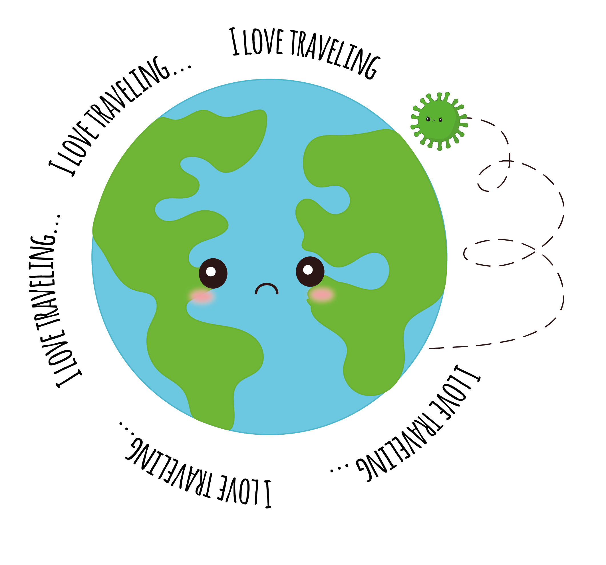
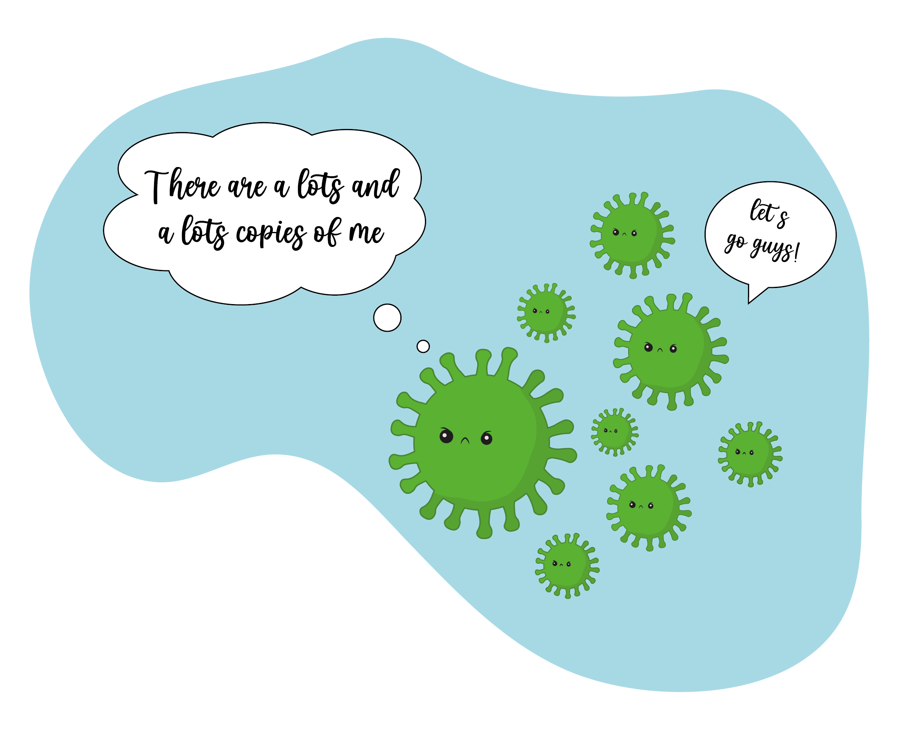
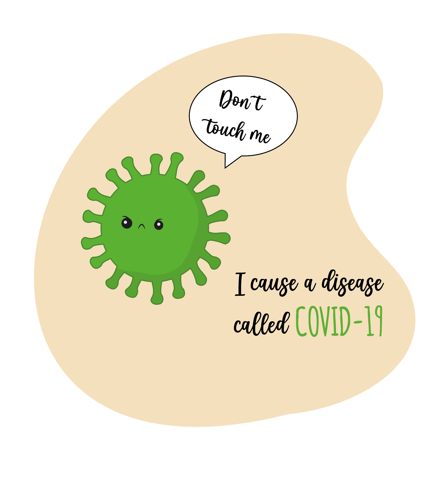
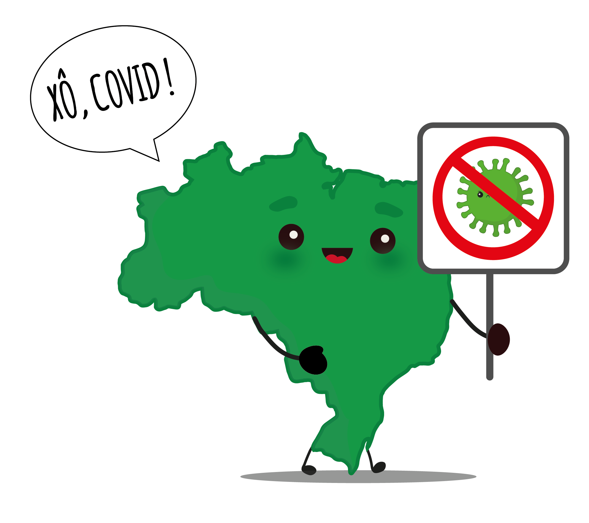
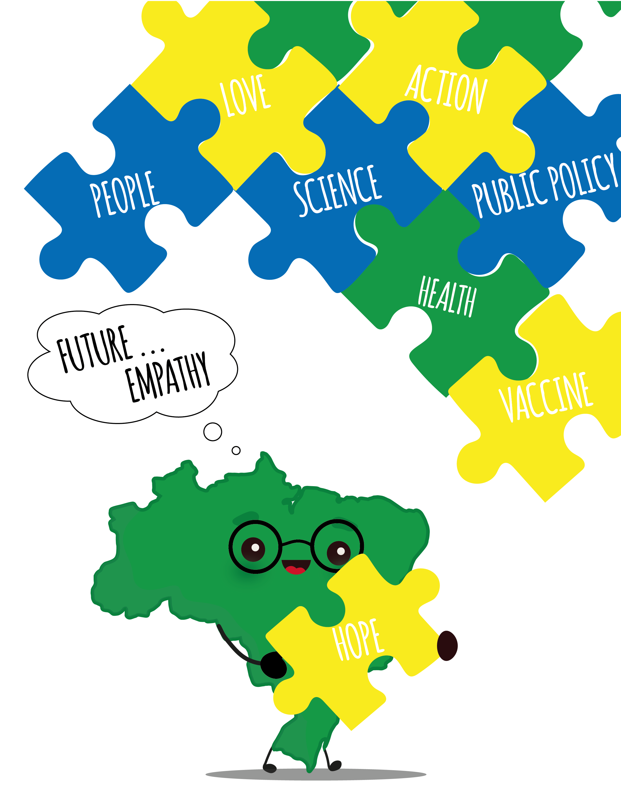
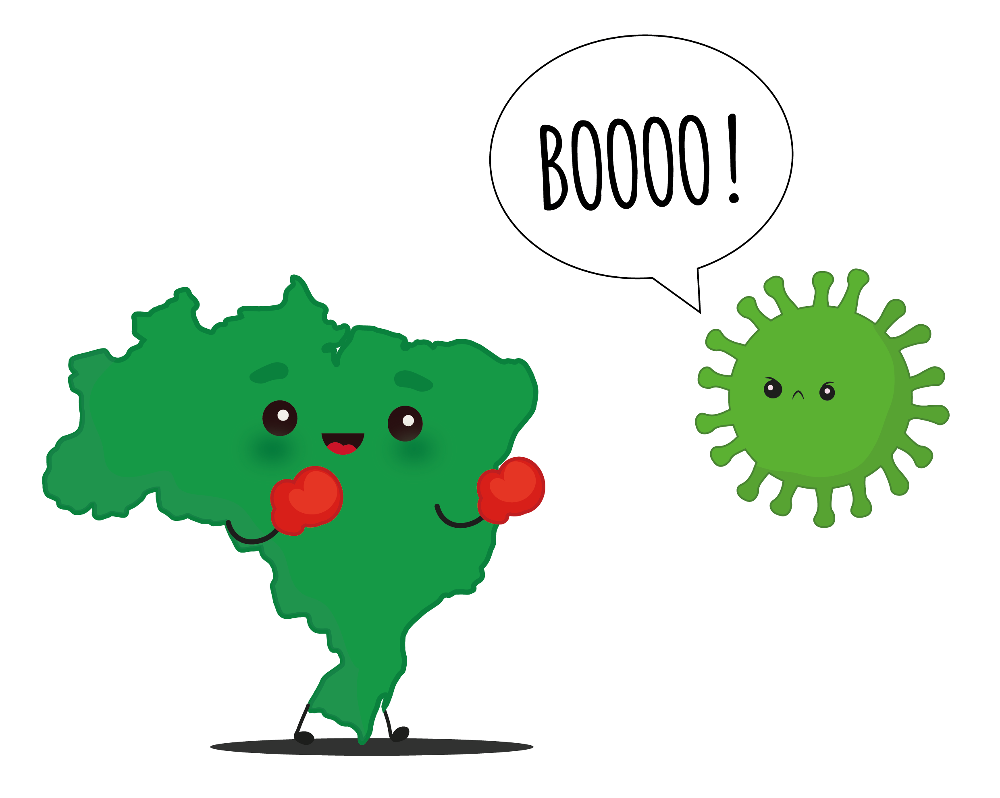
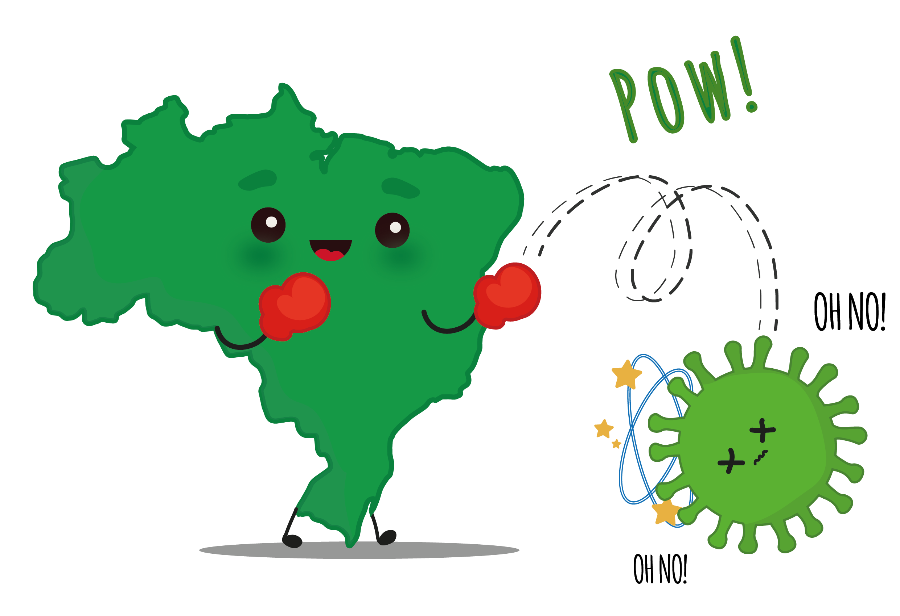

```{r, include = FALSE}
knitr::opts_chunk$set(
  collapse = TRUE,
  fig.align='center',
  comment = "#>"
)
```

The COVID-19 pandemic was and continues to be an unprecedented historic event. Here, we present cute and colorful illustrations that present the theme in a playful manner. We hope you enjoy it!

**A picture is worth a thousand words!**

You are encouraged to use the accompanying artwork when using or teaching `covidBR`! Please remember to credit if you repost ("Artwork by [Ariana Moura Cabral](https://orcid.org/0000-0002-9804-353X)").

## Meet the covidBR history

```{r echo=FALSE}
## 1
bills <- here::here("man", "figures", "Art-02.png")
link <- xfun::embed_file(bills, "Art-02.png", "Download 'greeting coronavirus' art")
link
```


```{r echo=FALSE}
## 2
bills <- here::here("man", "figures", "Art-03.png")
link <- xfun::embed_file(bills, "Art-03.png", "Download 'covonavirus popularity on tv' art")
link
```


```{r echo=FALSE}
## 3
bills <- here::here("man", "figures", "Art-04.png")
link <- xfun::embed_file(bills, "Art-04.png", "Download 'coronavirus loves to travel' art")
link
```



```{r echo=FALSE}
## 4
bills <- here::here("man", "figures", "Art-05.png")
link <- xfun::embed_file(bills, "Art-05.png", "Download 'coronavirus does not walk alone' art")
link
```



```{r echo=FALSE}
## 5
bills <- here::here("man", "figures", "Art-06.png")
link <- xfun::embed_file(bills, "Art-06.png", "Download 'meet disease' art")
link
```



```{r echo=FALSE}
## 6
bills <- here::here("man", "figures", "Art-07.png")
link <- xfun::embed_file(bills, "Art-07.png", "Download 'xô, covid!' art")
link
```



```{r echo=FALSE}
## 7
bills <- here::here("man", "figures", "Art-08.png")
link <- xfun::embed_file(bills, "Art-08.png", "Download 'together we can defeat COVID-19' art")
link
```



```{r echo=FALSE}
## 8
bills <- here::here("man", "figures", "Art-09.png")
link <- xfun::embed_file(bills, "Art-09.png", "Download 'BR vs. COVID' art")
link
```



```{r echo=FALSE}
## 9
bills <- here::here("man", "figures", "Art-10.png")
link <- xfun::embed_file(bills, "Art-10.png", "Download 'COVID-19 and a new resilient infrastructure landscape' art")
link
```




## covidBR hex sticker

```{r echo=FALSE}
hex <- here::here("man", "figures", "Art-01.png")
link <- xfun::embed_file(hex, "Art-01.png", "Download covidBR hex")
link
```


